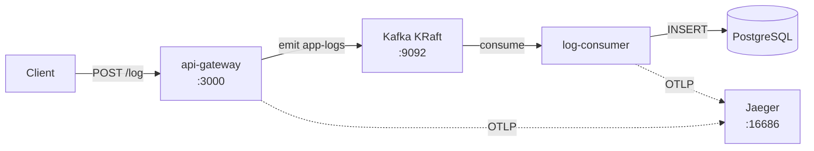

# Centralized Logging System

Microservicios con NestJS, Kafka y PostgreSQL para logging centralizado.

## Arquitectura



## Stack

| Capa | Tecnología |
|------|-----------|
| API Gateway | NestJS v11 HTTP + Kafka producer |
| Log Consumer | NestJS v11 Kafka microservice |
| Mensajería | Apache Kafka 4.3.0 (KRaft, sin Zookeeper) |
| Persistencia | PostgreSQL 17 (sin ORM, pg directo) |
| Trazabilidad | OpenTelemetry + Jaeger (all-in-one) |
| Contenedores | Docker Compose |
| Testing | Jest (unit + e2e) |

## Estructura

```
centralized-logging/
├── api-gateway/          # HTTP API + Kafka producer
│   ├── src/
│   │   ├── instrumentation.ts
│   │   ├── instrumentation.spec.ts
│   │   ├── main.ts
│   │   ├── app.module.ts
│   │   ├── app.controller.ts
│   │   ├── app.controller.spec.ts
│   │   └── dto/
│   │       ├── create-log.dto.ts
│   │       └── create-log.dto.spec.ts
│   ├── test/
│   │   ├── app.e2e-spec.ts
│   │   └── jest-e2e.json
│   ├── jest.config.ts
│   └── Dockerfile
├── log-consumer/         # Kafka consumer + PostgreSQL
│   ├── src/
│   │   ├── instrumentation.ts
│   │   ├── instrumentation.spec.ts
│   │   ├── main.ts
│   │   ├── app.module.ts
│   │   ├── app.controller.ts
│   │   ├── app.controller.spec.ts
│   │   └── database/
│   ├── jest.config.ts
│   └── Dockerfile
├── .env.example
├── docker-compose.yml
└── README.md
```

## Requisitos

- Docker y Docker Compose

## Cómo levantar

```bash
cp .env.example .env
docker compose up -d --build
```

Esperar unos segundos a que Kafka termine de iniciar, luego probar:

```bash
curl -X POST http://localhost:3000/log \
  -H "Content-Type: application/json" \
  -d '{"level": "info", "service": "test", "message": "hello world"}'
```

Respuesta esperada:

```json
{
  "status": "ok",
  "sent": {
    "level": "info",
    "service": "test",
    "message": "hello world",
    "timestamp": "2026-06-28T..."
  }
}
```

Para ver las trazas distribuidas, abrir Jaeger en http://localhost:16686, seleccionar el servicio `api-gateway` y buscar. Cada request a `POST /log` genera una traza completa: HTTP → Kafka produce → Kafka consume → PostgreSQL.

## Endpoints

| Método | Ruta | Body | Descripción |
|--------|------|------|-------------|
| POST | `/log` | `{ level, service, message }` | Enviar log a Kafka y persistir en DB |

### Validación

- `level`: `info`, `warn` o `error` (obligatorio)
- `service`: string no vacío (obligatorio)
- `message`: string no vacío (obligatorio)

## Desarrollo local

```bash
# Sin Docker, requiere Kafka y PostgreSQL en localhost
cd api-gateway && npm run start:dev
cd log-consumer && npm run start:dev
```

Las variables de entorno tienen defaults para localhost, no hace falta configurarlas.

## Testing

Cada microservicio tiene tests unitarios y el api-gateway tiene tests e2e. Los servicios externos (Kafka, PostgreSQL, OpenTelemetry) son mockeados — no requieren Docker para correr los tests.

| Proyecto | Tests | Archivos |
|----------|-------|----------|
| api-gateway | 7 unit + 5 instrumentation + 4 e2e | `app.controller.spec.ts`, `create-log.dto.spec.ts`, `instrumentation.spec.ts`, `app.e2e-spec.ts` |
| log-consumer | 3 unit + 5 instrumentation | `app.controller.spec.ts`, `instrumentation.spec.ts` |

```bash
# Unit tests (ambos proyectos)
cd api-gateway && npm test
cd log-consumer && npm test

# Watch mode (en cada proyecto)
cd api-gateway && npm run test:watch
cd log-consumer && npm run test:watch

# Coverage
cd api-gateway && npm run test:cov
cd log-consumer && npm run test:cov

# E2E (api-gateway)
cd api-gateway && npm run test:e2e
```

## Configuración

Copiar `.env.example` a `.env` y ajustar según sea necesario:

| Variable | Default | Descripción |
|----------|---------|-------------|
| `POSTGRES_DB` | `logs` | Nombre de la base de datos |
| `POSTGRES_USER` | `postgres` | Usuario de PostgreSQL |
| `POSTGRES_PASSWORD` | `postgres` | Contraseña de PostgreSQL |
| `KAFKA_CLUSTER_ID` | (generado) | ID único del cluster Kafka |
| `OTEL_EXPORTER_OTLP_ENDPOINT` | `http://jaeger:4318` | Endpoint OTLP para trazas |
